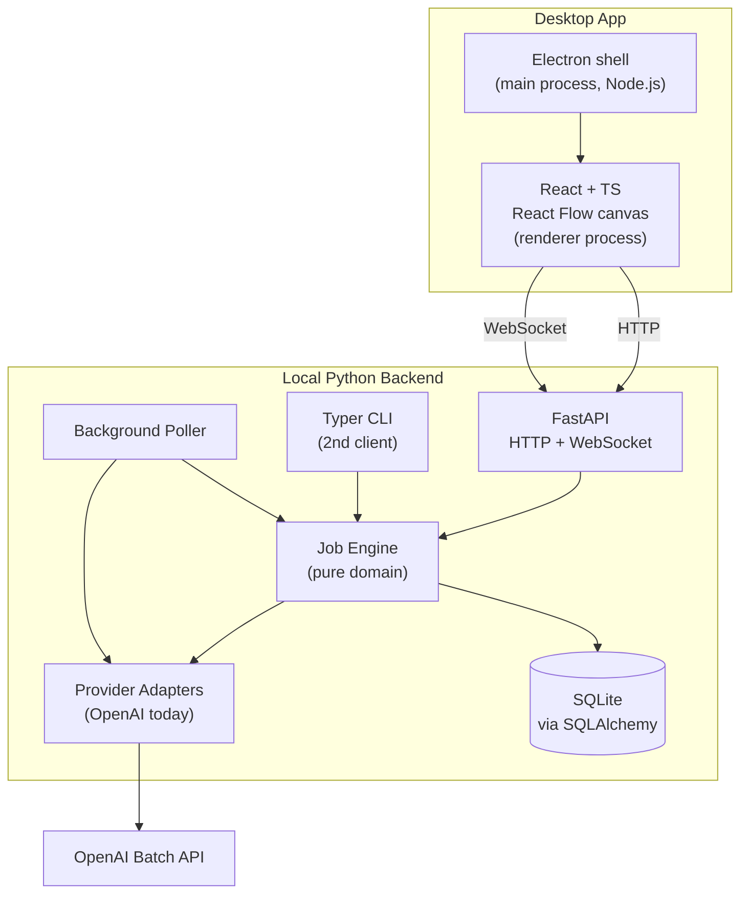

# Batchkit MVP — Electron + React Flow + FastAPI

## Defaults locked in

- **Stack:** Electron (shell) + React + TypeScript + Vite + Tailwind + shadcn/ui + React Query + React Flow + Monaco editor (frontend); FastAPI + Pydantic + SQLAlchemy 2.0 + SQLite (backend).
- **Target:** macOS only for MVP; cross-platform is a post-MVP packaging task.
- **Schema UX:** code editor only for MVP (paste a Pydantic class). Form builder is a post-MVP node-type upgrade.
- **Providers:** OpenAI only, but `Provider` port is defined day 1 so Anthropic/Google are new files later, not refactors.
- **Background execution:** Electron's main process spawns the Python backend as a child process on launch and kills it on app quit. The poller lives in the Python backend; jobs keep polling regardless of window state.

*Electron was chosen over Tauri after weighing tradeoffs: Tauri is ~10x smaller bundle and more modern, but Electron has 10+ years of ecosystem maturity and Stack Overflow coverage. For a learning-focused project where unblocking yourself matters more than bundle size, Electron wins.*

If any of these are wrong, say so before I start — they're easy to change now, painful later.

## Concepts you'll meet for the first time

Short explainers for the load-bearing concepts in this plan. Each links to what's worth reading up on after we build it once.

- **Protocol / port-and-adapter.** Python's `typing.Protocol` is a way to say "anything with these methods counts." Like a TypeScript interface or a Java interface, but the implementer doesn't have to declare it. In this plan, `Provider` is a Protocol: the engine takes "anything that looks like a Provider" and calls `upload_file`/`create_batch`/etc. on it. The OpenAI adapter happens to look like one. So does a `MockProvider` we use in tests. So will the Anthropic adapter someday. *Worth reading up on: hexagonal architecture (ports & adapters).*
- **ORM (SQLAlchemy).** A library that lets you read/write database rows as Python objects instead of writing SQL strings. You define a Python class with typed fields; SQLAlchemy creates the table and lets you do `session.add(job)` instead of `INSERT INTO jobs (...) VALUES (...)`. Why over raw SQL: one source of truth for your data shape (the Python class), and your IDE knows the types. *Worth reading up on: ORM vs query builder vs raw SQL.*
- **Async Python.** `async def` functions don't block while waiting on the network. Crucial here because the engine spends 99% of its time waiting on OpenAI to poll back. One Python process can manage hundreds of in-flight batches because none of them block the others. FastAPI is async-native — `async def` route handlers all the way down. *Worth reading up on: the asyncio event loop.*
- **WebSocket vs HTTP polling.** Two ways the UI gets live updates. Polling = browser asks "any updates?" every 5 seconds (wasteful, laggy). WebSocket = one persistent connection, server pushes the moment something happens. For live batch progress bars, WebSocket is night-and-day better. We use REST (HTTP) for "create a job" / "download CSV" because those are one-shot, and WebSocket for the progress stream. *Worth reading up on: WebSocket vs Server-Sent Events vs long-polling.*
- **Electron shell + Python subprocess (IPC).** Electron is a Node.js program that opens a window with a bundled Chromium browser pointing at your React app. When the app launches, Electron's *main process* also spawns the Python FastAPI backend as a child process (this is "IPC" — inter-process communication). The React app (running in Electron's *renderer process*) then talks to the Python backend over `http://localhost:<port>`. Quitting the app kills the Python process. *Worth reading up on: Electron's main vs renderer process split, `contextIsolation`/`nodeIntegration` security model, IPC patterns generally.*
- **React Flow.** A React library that gives you a draggable, zoomable canvas with nodes and wires "for free." You bring the node renderers (the visual content of each node) and the connection logic; React Flow handles drag, drop, pan, zoom, minimap, selection. Building this from scratch is a weeks-long project. *Worth reading up on: graph editor UX patterns.*

## Architecture




**The 3 architectural commitments that prevent tech debt:**

1. **Hexagonal architecture.** `backend/src/batchkit/domain/` and `backend/src/batchkit/engine/` know nothing about FastAPI, SQLite, OpenAI, or React. They depend on Protocols (`Provider`, `Store`, `Clock`). The adapters live in `providers/`, `store/`, `api/`. This is what makes the same engine work for desktop MVP today and a hosted web product tomorrow.
2. **The CLI doesn't die — it becomes a second client.** Whatever the GUI can do, the CLI can do, because both call the same Engine. This protects the directness/taxonomy workflows you already have.
3. **Job state is in SQLite from day 1, not JSON files.** Atomic transactions, queryable history, trivially extendable to a hosted multi-tenant store later.

## Repository layout

```
oai-batchkit/
  backend/
    pyproject.toml
    src/batchkit/
      domain/        # Job, Run, Batch, Schema, CostEstimate (pure types)
      engine/        # build/submit/monitor/download/merge (pure logic)
      providers/
        base.py      # Provider Protocol
        openai.py    # the only adapter in MVP
      store/
        models.py    # SQLAlchemy ORM
        repo.py      # JobRepo, RunRepo, BatchRepo
                     # (no Alembic migrations dir in MVP; create_all() at startup)
      api/
        app.py       # FastAPI app factory
        routes/      # jobs.py, runs.py, providers.py, files.py
        ws.py        # WebSocket progress channel
      daemon/
        poller.py    # background process entrypoint
      cli/
        main.py      # Typer; thin wrapper over Engine
    tests/
  frontend/
    package.json
    vite.config.ts
    src/
      api/           # typed client generated from OpenAPI
      ws/            # WebSocket hook
      canvas/        # React Flow setup + node registry
        nodes/       # DatasetNode, PromptSchemaNode, ModelNode, OutputNode
      runs/          # RunListPage, RunDetailPage
      components/    # design-system primitives
    tests/
  shell/
    package.json     # Electron + electron-forge deps
    forge.config.js  # build / packaging config
    src/
      main.js        # Electron main process: window, Python subprocess lifecycle
      preload.js     # secure bridge between renderer and main (contextIsolation on)
  examples/          # keep current example task files for docs
  README.md
```

## Engineering practices baked in from day 1

- **Python:** `ruff` + `mypy --strict`, `pytest` + `pytest-asyncio`, `pydantic` for every DTO crossing a boundary, `SQLAlchemy 2.0` async. *No Alembic in MVP — schema lives in `models.py`, recreated on startup until we have real users. Alembic the day we ship to a second person.*
- **Frontend:** TypeScript strict, `eslint` + `prettier`, `vitest` for unit tests. *No Playwright in MVP — end-to-end testing belongs post-MVP once flows stabilize; vitest covers regression value for the iteration phase.*
- **API contract:** FastAPI auto-generates OpenAPI docs at `/docs`. *For MVP, hand-write the small set of TypeScript types the frontend needs and add codegen post-MVP once the API shape stops changing daily — codegen during high-churn iteration breaks more than it helps.*
- **CI (GitHub Actions):** lint + typecheck + tests on every PR, separate jobs for backend and frontend.
- **Pre-commit hooks:** lint + format + typecheck.
- **Domain model first:** every phase starts with `domain/` types and tests, then adapters. Stops the "I'll just hardcode this for now" failure mode.

## Phased build plan

Each phase ends with a runnable artifact and tests. Stop here if a phase is the natural MVP boundary for you; everything below is value-add.

### Phase 0 — Repository scaffolding (1 day)

- Create `backend/`, `frontend/`, `shell/` trees.
- Wire up `pyproject.toml` (backend), `package.json` + Vite (frontend), Tauri config.
- Lint/test/typecheck working in CI.
- Pre-commit hooks installed.

*Worth reading up on: monorepo layouts, why `pyproject.toml` replaced `setup.py`, what Vite is and why not webpack.*

### Phase 1 — Port the engine (3–4 days)

- Define `domain/` types: `Job`, `Run`, `Batch`, `BatchStatus`, `SchemaDef`, `CostEstimate`.
- Define `providers/base.py:Provider` Protocol covering: `upload_file`, `create_batch`, `retrieve_batch`, `cancel_batch`, `download_file`, `estimate_cost`.
- Implement `providers/openai.py` by lifting and adapting `[llm_directness_experiment/src/submitter.py](llm_directness_experiment/src/submitter.py)` and `[llm_directness_experiment/src/downloader.py](llm_directness_experiment/src/downloader.py)`.
- Implement `engine/` modules by lifting and adapting:
  - `engine/builder.py` from `[llm_directness_experiment/src/builder.py](llm_directness_experiment/src/builder.py)` (endpoint-aware via `Provider`)
  - `engine/monitor.py` from `[llm_directness_experiment/src/monitor.py](llm_directness_experiment/src/monitor.py)` (drop `Live` UI, just yield events)
  - `engine/merger.py` from `[llm_directness_experiment/src/merger.py](llm_directness_experiment/src/merger.py)`
  - `engine/tokens.py` from `[llm_directness_experiment/src/tokens.py](llm_directness_experiment/src/tokens.py)`
- Smoke test: run the directness sample CSV end-to-end through the new engine with a mocked `Provider`.

*Worth reading up on: `typing.Protocol`, the repository pattern, why we lift logic before adding a database.*

### Phase 2 — SQLite store (1–2 days)

- `store/models.py`: ORM for `jobs`, `runs`, `batches`, `files`, `events`.
- `store/repo.py`: typed repositories returning domain objects, not ORM rows.
- `store/db.py`: on backend startup, call `metadata.create_all()` so a fresh `.db` file gets the current schema. *No Alembic — for an MVP with one user (you), we blow away the DB whenever the schema changes. Alembic only earns its complexity once someone else's data is at stake.*
- Engine swaps `JSON state.json` for `Store.save_run(run)` / `Store.load_run(id)`.

*Worth reading up on: ORMs, repository pattern, SQLite's `WAL` journal mode (relevant if the daemon and API write concurrently).*

### Phase 3 — FastAPI + WebSocket (2–3 days)

- Routes: `POST /jobs`, `GET /jobs/{id}`, `POST /jobs/{id}/run`, `POST /jobs/{id}/cancel`, `GET /jobs/{id}/results.csv`, `POST /files` (CSV upload), `POST /estimate-cost`, `GET /providers/{name}/models`.
- WebSocket `/ws/jobs/{id}`: streams `BatchEvent` (status, completed, failed, cached-tokens) for live UI.
- FastAPI auto-serves OpenAPI docs at `/docs`. *No client codegen yet — frontend will hand-write its types in Phase 5.*

*Worth reading up on: REST vs WebSocket, FastAPI's dependency injection, why we use Pydantic for request/response models.*

### Phase 4 — Background poller (1–2 days)

- `daemon/poller.py` runs as a separate process (started by Tauri on app launch).
- Polls every in-flight batch across all jobs, writes events to the store.
- API broadcasts those events over WebSocket to any connected UI.
- Killing the desktop window does not kill the poller; quitting the app does.

*Worth reading up on: process supervisors, why we separate the poller from the API server (single-responsibility, independent restart).*

### Phase 5 — Frontend foundation (2 days)

- Vite + React + TS + Tailwind (or shadcn/ui) set up.
- `src/api/types.ts`: hand-written TypeScript mirrors of the FastAPI Pydantic models we hit (~10 types). *Codegen comes post-MVP — during the iteration phase where the API shape changes daily, generated clients break more than they help. Hand-writing 10 types is 30 minutes of work and the IDE will scream if backend and frontend drift.*
- `src/api/client.ts`: typed `fetch` wrapper around the REST routes.
- `useJob(id)` React Query hook + `useJobEvents(id)` WebSocket hook.
- Basic shell with sidebar nav (Runs, Settings) + empty canvas page.

*Worth reading up on: React Query (server state vs UI state), why we keep WebSocket out of React Query and use a separate hook, Tailwind's utility-first philosophy.*

### Phase 6 — Canvas + 4 node types (4–5 days)

- `react-flow` set up with custom node renderer.
- Node types:
  - **DatasetNode** — drag-drop CSV upload, shows row count + column chips.
  - **PromptSchemaNode** — Monaco editor for system prompt + Monaco editor for Pydantic schema (Phase-1 MVP: code-only; form builder is post-MVP).
  - **ModelNode** — provider/model dropdown (OpenAI only for now), live cost estimate panel that re-computes on input change.
  - **OutputNode** — progress bar + per-batch status badges while running; "Download CSV" button when complete.
- Per-node config opens in a right-hand inspector panel (Gumloop pattern).
- "Run" button sends the canvas graph to `POST /jobs/{id}/run`.

*Worth reading up on: React Flow's node/edge data model, controlled vs uncontrolled inputs, Monaco editor.*

### Phase 7 — Electron shell + Mac packaging (2–3 days)

- `shell/src/main.js`: on `app.whenReady()`, spawn the Python backend (`child_process.spawn`) pointing at the bundled interpreter; on `app.before-quit`, terminate the subprocess.
- `shell/src/preload.js`: enable `contextIsolation: true`, `nodeIntegration: false` from the first commit. The preload exposes a *minimal* `window.batchkit` API to the renderer (e.g., `openExternalLink`, `revealInFinder`). The React app uses HTTP/WebSocket for everything else.
- Bundle a frozen Python interpreter (PyInstaller) + backend wheel into the `.app` resources directory.
- Use `electron-forge` (Electron's official build tool) to produce a signed, notarized `.dmg`.

*Worth reading up on: Electron's main/renderer process model, contextIsolation security model (read the [official guide](https://www.electronjs.org/docs/latest/tutorial/context-isolation)), macOS Gatekeeper, code signing & notarization (huge "wait, what is happening?" moment for everyone the first time).*

### Phase 8 — Ship + docs (1 day)

- README rewrite for the new architecture.
- Migration note explaining the CLI is now a backend client (lives in `backend/src/batchkit/cli/main.py`).
- Tag `v0.1.0-mvp`; publish DMG to a GitHub Release.

## Total estimated effort

16–21 working days for a single engineer to ship Phase 0 → Phase 8 (revised down from 17–22 after trimming Alembic, codegen, and Playwright). Realistic MVP boundary if you want to ship earlier is **end of Phase 6** (about 13 days): the canvas works end-to-end, the daemon runs jobs, results download — Tauri/packaging is the polish on top.

These are senior-engineer estimates. As a beginner you'll spend more time on things like "why does my Vite dev server hot-reload break when I edit this file" than on architecture. Plan for ~2x. The flip side is that almost everything you debug is a concept you'll know forever.

## What this plan deliberately does *not* include (and where each lives later)

- **Alembic migrations** → add the day a second person starts running this against a DB they care about.
- **OpenAPI → TypeScript codegen** → add once API churn slows. Recommended tool: `openapi-typescript`.
- **Playwright end-to-end tests** → add once the canvas UX stabilizes (probably after Phase 8).
- **Visual schema form builder** → upgrade to `PromptSchemaNode` post-MVP.
- **Anthropic / Google providers** → new files in `providers/`, no engine change.
- **Web deployment** → same FastAPI + same React app, hosted; only `shell/` becomes irrelevant.
- **Prompt refinement / iteration helpers** → new node types on the canvas.
- **Multi-step pipelines (chained model calls)** → new node types + engine support for DAG execution. The canvas already supports this visually; engine needs the executor.
- **Real-time desktop notifications** → a `notify/` module on the Python side, reusing the `notify/` scaffolding from the current repo.

## Open decisions I'd flag for you before I start

- **Backend packaging into the Electron bundle.** Two options: ship a frozen Python interpreter (PyInstaller/Nuitka) or require the user to have Python 3.11+ installed. The first is shippable to non-developers; the second is a faster MVP. I'd default to PyInstaller for Phase 7.
- **Provider credentials storage.** macOS Keychain via `keytar` (Electron has first-class support), not env vars. Worth doing right from day 1.
- **Whether to keep the current `examples/*/task.py` Protocol.** I'd keep `BatchTask` as the Python-level integration point for advanced users / the CLI, and have the canvas serialize node-graphs into a `BatchTask`-shaped object under the hood. Best of both worlds.

