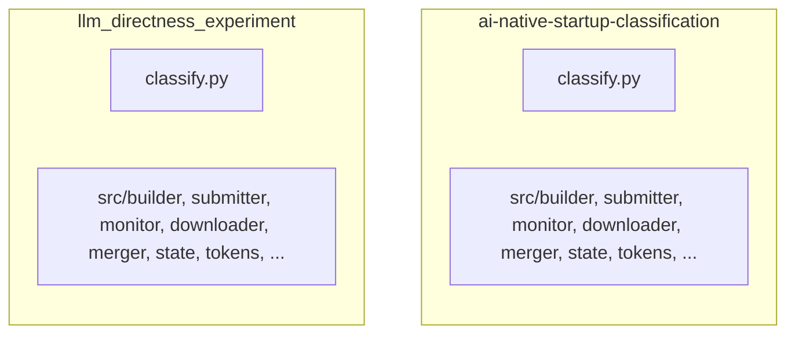
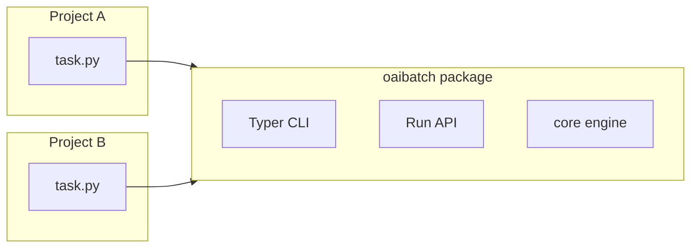
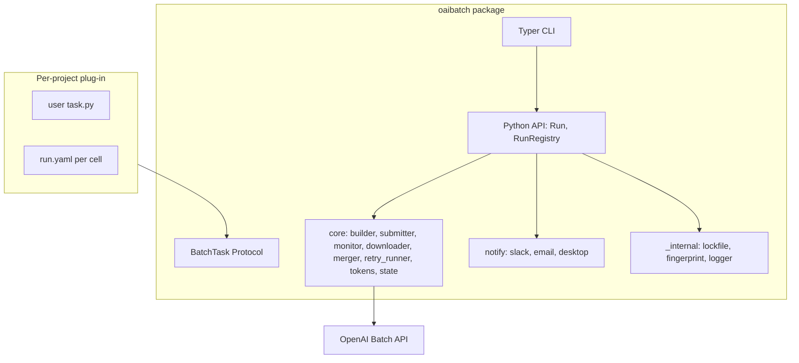
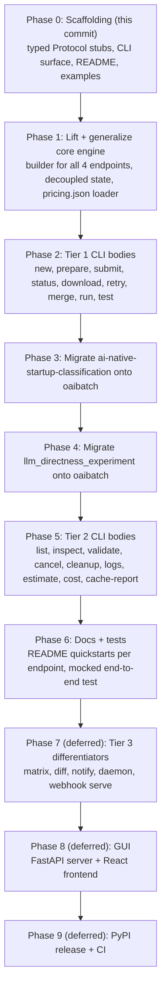

# oaibatch

A generalizable CLI and Python framework for the [OpenAI Batch API](https://platform.openai.com/docs/guides/batch). Take any structured-output task from CSV to merged results without rewriting infrastructure.

[](#status)
[]()
[](LICENSE)

> **Status:** scaffolding (pre-alpha). The package layout, CLI surface, type signatures, and roadmap below are committed and tested. Command bodies are stubs raising `NotImplementedError`. Implementation phases land next; the CLI surface itself will not change in incompatible ways. See the [roadmap](#roadmap).

## Why this exists

Every research project that uses OpenAI's Batch API ends up reimplementing the same plumbing:

- A pre-flight cost estimator with `tiktoken`
- A JSONL request-file builder with strict-mode JSON schema injection
- An uploader with `tenacity` retry policies and `BillingLimitError` handling
- A monitor with sliding-window queue pressure control against the 15B-token enqueued cap
- A downloader with multi-endpoint result parsing
- A retry runner that rebuilds JSONLs from failed `custom_id`s
- A merger that produces the final CSV plus a cost report
- An atomic JSON checkpoint so the whole pipeline is resumable

I built this code three times across two research projects before deciding it should be one library. **oaibatch** is that library: the infrastructure stays, the task-specific bits become a single ~80-line plug-in.

The duplication problem in two existing repos:



Becomes:



## Architecture



Three concepts you only need to learn once:

1. **`BatchTask`** — a Protocol you implement. Defines schema, system prompt, row formatting, and `custom_id` generation for your workload.
2. **`Run`** — one `(task, params)` cell. The directness experiment's `arm` axis is just a key in `params`; the framework treats arms identically to model variants, prompt variants, dataset slices, or any other axis.
3. **Run directory** — every run owns its own folder with `run.yaml` (immutable), `state.json` (atomic checkpoint), `requests/`, `results/`, `errors/`, `outputs/`, `final.csv`, `run.log`, and a `lockfile` for concurrent-CLI safety.

## CLI surface (preview)

```text
$ oaibatch --help

  oaibatch is a generalizable CLI for OpenAI's Batch API.

  Lifecycle:
    new        Bootstrap a new run directory
    prepare    Build per-batch JSONL request files; print cost estimate
    submit     Upload + create + monitor with sliding-window queue control
    status     Rich status table (with --watch)
    download   Fetch result + error files; parse to per-batch CSVs
    retry      Rebuild JSONLs for failed/expired requests
    merge      Concatenate per-batch CSVs; print distribution + cost report
    run        Full pipeline: prepare -> submit -> download -> merge
    test       Single-row sync probe via flex tier (cheap prompt iteration)

  Observability + safety:
    list         Every run with status badges, cost so far, last activity
    inspect      Request, response, parsed output, validation, cost for one row
    validate     Lint a JSONL: file size, body shape, custom_id uniqueness
    cancel       Cancel one or all in-flight batches
    cleanup      Delete uploaded file_ids from OpenAI once results are downloaded
    logs         Tail + grep <run_dir>/run.log
    estimate     Cost estimate for any pre-built JSONL
    cost         Measured cost breakdown + predicted-vs-actual drift
    cache-report Per-batch prompt-cache hit rate
```

Tier 3 (`matrix`, `diff`, `notify`, `daemon`, `webhook serve`) is registered but hidden until implementation lands; see [roadmap](#roadmap).

## A complete `BatchTask`

Everything a project needs to plug in is in one file:

```python
from __future__ import annotations
from collections.abc import Iterable, Mapping
from typing import Any, Literal

from pydantic import BaseModel, Field

from oaibatch.task import BatchTask, Endpoint, InputSource


class ClassificationResult(BaseModel):
    CompanyID: str
    label: Literal["positive", "neutral", "negative"]
    confidence: int = Field(ge=1, le=5)
    reason: str


class SentimentTask:
    name = "sentiment"
    endpoint = Endpoint.RESPONSES

    def schema(self, params): return ClassificationResult
    def system_prompt(self, params):
        return "Read the company description and assign a sentiment label..."
    def cache_key(self, params): return f"{self.name}-v1"
    def iter_inputs(self, source, params): yield from source
    def format_user_message(self, row, params):
        return f"CompanyID: {row['id']}\nDescription: {row['description']}"
    def custom_id(self, row, params): return f"{self.name}-{row['id']}"
    def parse_result(self, parsed, raw, params): return parsed
```

That's it. The framework handles every other concern: pre-flight cost, JSONL building with strict schema injection, uploads with retry policies, queue-pressure-controlled submission, polling, downloading, multi-endpoint parsing, validation, retry of failed rows, merging, cost reporting.

Three example tasks live under [`examples/`](examples/) — one per supported endpoint type:

- [`classification_responses_api/`](examples/classification_responses_api/) — structured outputs via Responses API
- [`embeddings_corpus/`](examples/embeddings_corpus/) — vectorize a corpus at batch pricing
- [`moderations_audit/`](examples/moderations_audit/) — content-safety audit at scale

## Quickstart (planned)

> Bodies still raise `NotImplementedError`. The shapes below are the committed public API.

```bash
# Install (editable, from a local checkout)
pip install -e .

# Bootstrap a new run
oaibatch new examples.classification_responses_api.task:ClassificationTask \
  --run pilot --params model=gpt-5.4-nano

# Pre-flight cost estimate
oaibatch prepare --run pilot --data data/sample.csv --dry-run

# Real run with sliding-window submission
oaibatch run --run pilot --data data/sample.csv --concurrency 3

# Inspect one row end-to-end
oaibatch inspect --run pilot --custom-id sentiment-abc123
```

## Endpoint coverage

oaibatch is endpoint-agnostic at the framework level. A single `BatchTask` chooses one of:

| Endpoint              | Schema injection            | Use case                      |
| --------------------- | --------------------------- | ----------------------------- |
| `/v1/responses`       | `text.format` (strict mode) | Structured-output classification (default) |
| `/v1/chat/completions`| `response_format`            | Legacy or chat-style prompts  |
| `/v1/embeddings`      | none                         | Vectorize huge corpora cheaply|
| `/v1/moderations`     | none                         | Content-safety audits at scale|

## Reliability hardening

Every run gets, by construction:

- **Atomic state checkpoint.** `state.json` is written via `mkstemp` + `os.replace`. A crash mid-write never corrupts the checkpoint.
- **Per-run lockfile.** Two `submit` invocations cannot collide on the same run.
- **Prompt + dataset fingerprinting.** SHA-256 of `task.system_prompt(params)` and the input dataset are stored at run-creation. Subsequent verbs verify and refuse to mix incompatible runs (`--force` to override).
- **Idempotent retry.** `custom_id`s already completed in any prior run of this `(task, params)` cell are skipped on rebuild.
- **`BillingLimitError` non-retry.** Hard-limit-reached is bubbled with a Rich resume panel telling the user what to fix.
- **Sliding-window queue control.** Stops submitting at 90% of the 15B-token enqueued cap, leaving headroom for retries.
- **Tenacity random-exponential backoff** on every API call; jitter prevents thundering-herd retries.

## Roadmap



## Status

Phase 0 is what this commit ships. The full plan lives in the originating Cursor planning doc; this README is the public face of the work.

Until Tier 1 lands, the CLI is useful for one thing: showing the surface. `oaibatch --help` is the public spec.

## Install

```bash
git clone https://github.com/k-hanafi/oaibatch.git
cd oaibatch
pip install -e ".[dev]"
pytest -q
oaibatch --help
```

## Contributing

Issues and PRs welcome once Phase 1 lands and command bodies start landing one at a time. Until then the code is intentionally narrow; the value of this commit is the architecture and the CLI surface.

## License

MIT — see [LICENSE](LICENSE).
